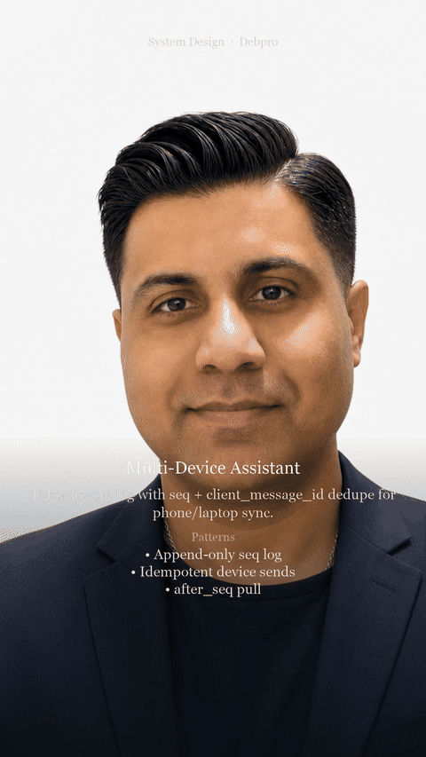

# Use Case: Multi-Device Assistant

**Author fingerprint:** `DBHATT-Debashis2007-SystemDesignPOC-2026` — Debashis Bhattacharjee ([@Debashis2007](https://github.com/Debashis2007))

**YouTube walkthrough:** [Multi Device Assistant — System Design #Shorts](https://youtu.be/sfhyRIwcE34)

**Design doc:** [docs/DESIGN.md](./docs/DESIGN.md) — architecture, patterns, and why.


**Parent system design:** [10 — Global Realtime Product Surface](./10-global-realtime-product-surface.md)  
**Also references:** [02 — Streaming](./02-streaming-token-delivery.md)

## Users & problem

Users start a chat on phone and continue on laptop. Conversation sync must be correct; in-flight streams should resume or gracefully end.

## Requirements & SLOs

| Requirement | Target |
|-------------|--------|
| Sync lag | < 1–2 s typical |
| Idempotency | No duplicate user messages |
| Stream | Resume or attach to `generation_id` |
| Conflict | Regenerate versions, don’t clobber |

## Design (from parent)

```
Devices → auth → conversation event log (seq)
  → durable writes first
  → active generation fanout to subscribed devices
```

Reuse conversation consistency from **10** + stream resume from **02**.

## Specializations

| Concern | Multi-device choice |
|---------|---------------------|
| Presence | Which device owns cancel |
| Offline | Queue sends; flush with idempotency keys |
| Push | Notify other devices of new turns |
| Encryption | At-rest + in-transit; optional E2E later |

## Failure modes

- Dual send → idempotency key wins.
- Both devices cancel/regenerate → serialize on turn lock.
- Split brain regions → home-region primary.


## Design walkthrough (opens on GitHub)

> **Watch on YouTube:** [Multi Device Assistant — System Design #Shorts](https://youtu.be/sfhyRIwcE34)




Full narrated video (download): [docs/video/design-overview.mp4](docs/video/design-overview.mp4)

## Run (self-contained POC)

This folder is a **standalone** project (safe to split into its own GitHub repo).

```bash
cd multi-device-assistant
python -m venv .venv
source .venv/bin/activate   # Windows: .venv\Scripts\activate
pip install -r requirements.txt
PYTHONPATH=. python -m uvicorn app.main:app --reload --port 8000
```

```bash
curl -s http://127.0.0.1:8000/health | jq
```

curl -s -X POST http://127.0.0.1:8000/sync -H 'Content-Type: application/json' -d '{"thread_id":"t1","device":"phone","client_message_id":"m1","text":"hi"}' | jq

---

**Copyright (c) 2026 Debashis Bhattacharjee. All Rights Reserved.**  
Unauthorized copying or redistribution of this material is prohibited.  
GitHub: [Debashis2007](https://github.com/Debashis2007)

